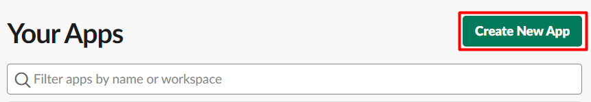

# Slack reaction docs
This is just documentation for a private extension.

## How to obtain User OAuth Token

1. Open this [link](https://api.slack.com/apps).
2. Click “Create New App” button. If this button is not available for you, log in Slack firstly.

