# Slack reaction docs
*This is just documentation for a private extension.*

## How to obtain User OAuth Token

1. Open this [link](https://api.slack.com/apps).
2. Click on **Create New App** button. ***If this button is not available for you, log in Slack firstly.***

3. From opened modal select **From scratch**.

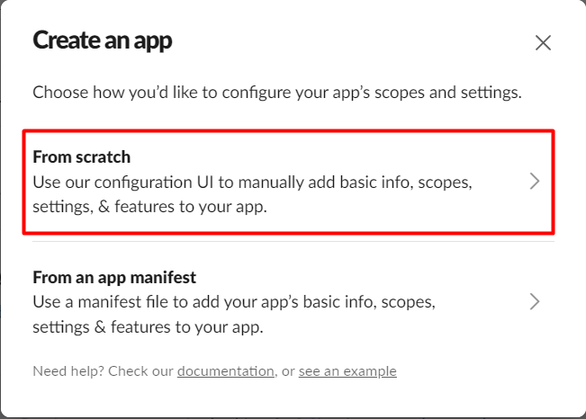

4. In the next modal select a name for your app, our workspace then click on **Create App** button.

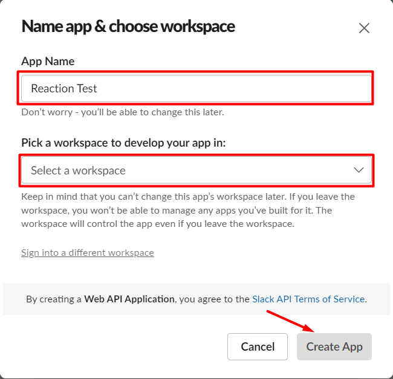

5. After creation select **Permissions**.

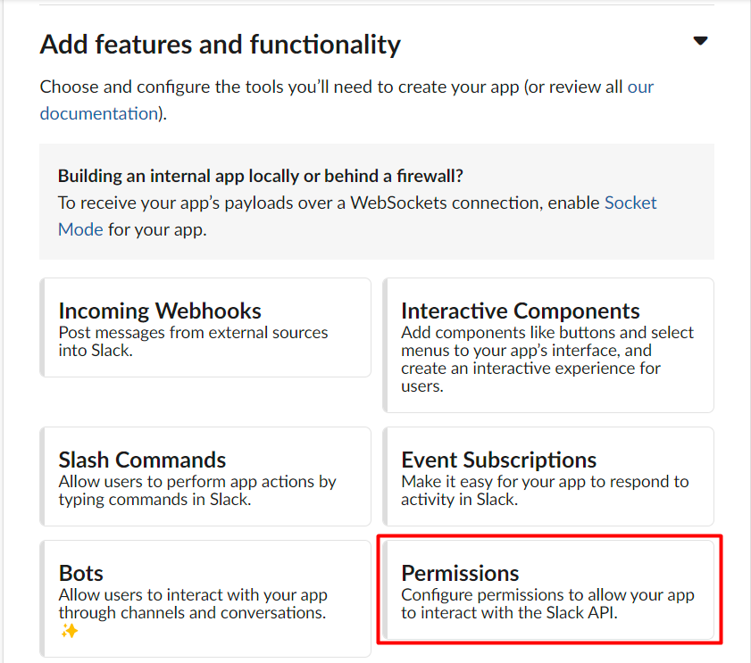

6. Scroll down to **Scopes** and find **User Token Scopes** subsection.

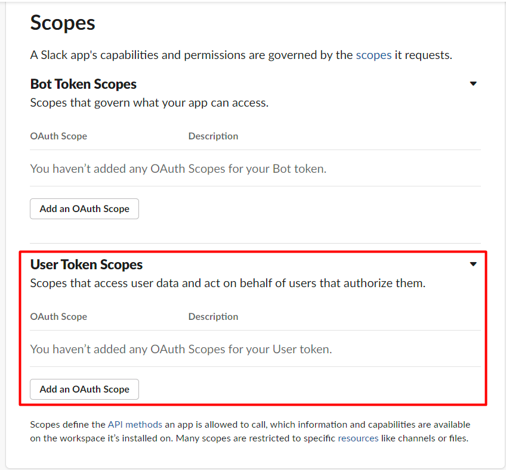

7. Sequentially click on **Add an OAuth Scope** and add the following scopes:
- **channels:history**
- **channels:read**
- **groups:history**
- **groups:read**
- **im:history**
- **im:read**
- **mpim:history**
- **mpim:read**
- **reactions:read**
- **reactions:write**

8. Scroll up and find **OAuth Tokens for Your Workspace** then click on **Install to Workspace** button.

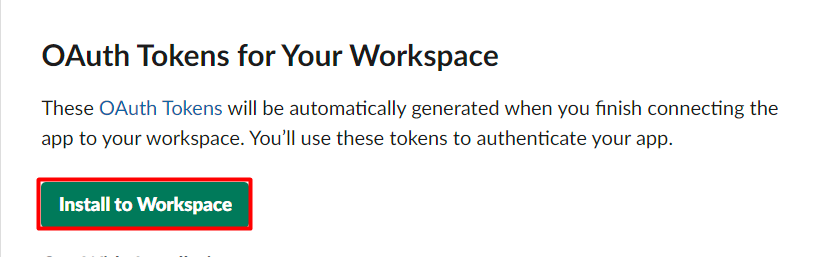

9. In opened page click on **Allow** button.
10.  ***Make sure that the token starts with "xoxp-"***.
11.  Copy your token.
12.  Paste token in extension pop-up and click on **Save settings** button.

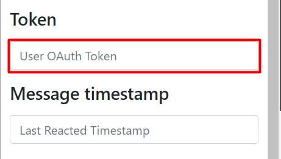

## How to obtain Last Reacted Timestamp

1. Open **zq-karma** channel in Slack.
2. Hover on the wanted message and do right-click then select **Copy link** option.
3. Place somewhere the link.
4. From copied link keep just the last part, the digits. **(e.g. 1682715942947569)**
5. From saved part numerate 6 digits from the end and insert a dot. **(e.g. 1682715942.947569)**
6. Paste obtained value in extension pop-up and click on **Save settings** button.

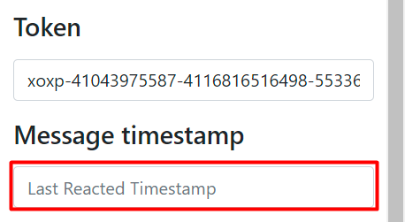

## How to obtain Smiles Names

1. In Slack open **Emoji** pop-up.

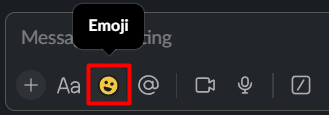

2. Hover on the wanted emoji.

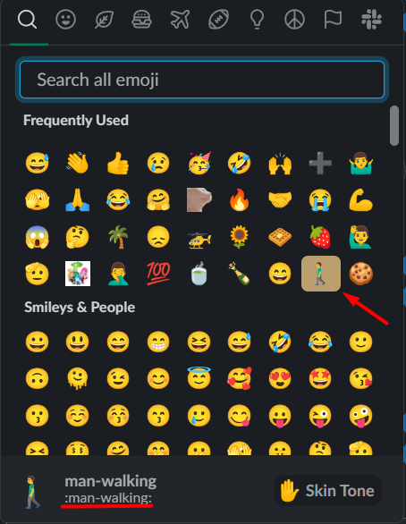

3. Copy and paste underscored name **without ":"** in extension pop-up, and click on **Save settings** button.

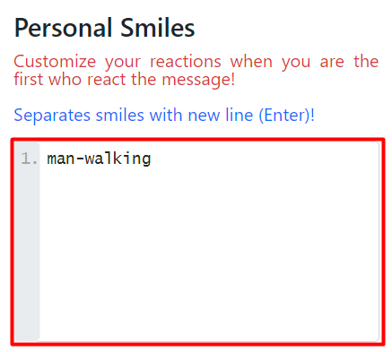

4. You can also add smiles with **skin-tone**. See the example below.

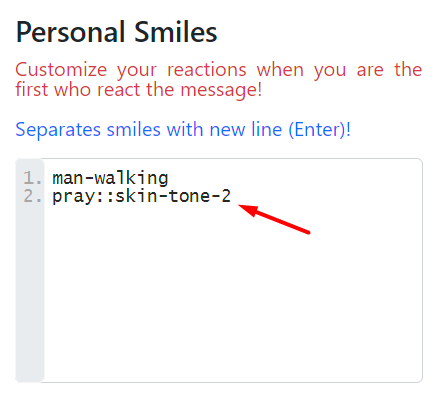

## How to obtain Users Codes ***(coming soon)***

## How to update the extension for new version

1. Download the archive with the latest version.
2. Replace all files from the archive with files of previous version.
3. Open **Manage extension** settings or open this link *chrome://extensions/* in Chrome tab.
4. Find extension and click on **refresh** button.

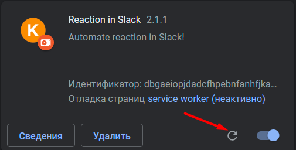